**FiliEre Sciences MathEmatiques et Informatique**

**Projet de Fin dEEtudes**

**Semestre S6** 

**MEmoire**

**Gestion de location de voiture**

   PrEsentE par :

**Bouhrir** **Ayat                                                                                  Zerroudi Jalal**

Encadrant : **Pr. Bennani Mohamed Taj**

Soutenu le :

Jury :

Examinateur 1 :

Examinateur 2 :

**_AnnEe Universitaire : 2023/2024_**

**Remerciements**
=================

**Au nom dEAllah le tout misEricordieux,**

On tient E adresser mes sincEres remerciements E mon encadrant, Monsieur **Bennani Mohamed Taj**, pour son accompagnement prEcieux tout au long de mon projet de fin d'Etudes. Son expertise, ses conseils judicieux et son soutien constant ont EtE essentiels E la rEussite de ce travail. Je suis profondEment reconnaissant pour sa patience et son engagement envers mon dEveloppement acadEmique et professionnel.

Nous tenons Egalement E remercier **les membres du jury** pour leur Evaluation attentive de notre travail.

Un merci spEcial E tous ceux qui ont contribuE, directement ou indirectement, E la rEalisation de ce projet.

  

**REsumE**
==========

Ce projet de fin d'Etudes prEsente le dEveloppement d'une application de bureau innovante, destinEe E rEvolutionner la gestion des opErations au sein d'une agence de location de voitures. L'objectif principal est de simplifier et d'automatiser l'organisation des donnEes, amEliorant ainsi l'efficacitE et la productivitE de l'agence.

L'application offre une solution complEte pour la gestion des rEservations, des clients, des vEhicules et des employEs. Elle permet aux employEes de gErer facilement les flux de travail quotidiens, l'application permet de rEduire les erreurs humaines et de maximiser l'utilisation des ressources.

La phase de conception du projet a dEbutE par une analyse des besoins dans ce secteur, suivie par l'Elaboration d'une Etude conceptuelle et technique. Cette Etape prEliminaire a EtE cruciale pour dEfinir les spEcifications et l'architecture logicielle nEcessaires.

Le **backend** de lEapplication est base sur deux ElEments essentiels : le langage de programmation **C#** et **MySQL** pour la gestion de la base de donnEes.

Le **frontend** utilise **Windows Presentation Foundation (WPF)** avec le framework **.NET 8.0** pour offrir une expErience utilisateur riche et interactive.

**Sommaire**
============

[Remerciements. 2](#_Toc167027324)

[REsumE. 3](#_Toc167027325)

[Sommaire. 4](#_Toc167027326)

[Liste des figures. 6](#_Toc167027327)

[Liste des Tables. 6](#_Toc167027328)

[Liste des Acronymes. 7](#_Toc167027329)

[Introduction GEnErale. 8](#_Toc167027330)

[Chapitre 1 : Analyse et cadre gEnErale de projet. 9](#_Toc167027331)

[I.            INTRODUCTION.. 9](#_Toc167027332)

[II.          Etude de cahier de charge. 9](#_Toc167027333)

[2.1         ProblEmatique. 9](#_Toc167027334)

[2.2         LEobjectif 9](#_Toc167027335)

[2.3         Solution. 9](#_Toc167027336)

[III          . Analyse des besoins. 10](#_Toc167027337)

[3.1         Les besoins fonctionnels. 10](#_Toc167027338)

[3.2         Les besoins techniques. 11](#_Toc167027339)

[a.      Outils et technologies. 11](#_Toc167027340)

[b.     Les langages de programmation utilisEs. 13](#_Toc167027341)

[c.      Les cadres applicatifs (Frameworks). 14](#_Toc167027342)

[**1)**      **WPF**. 14](#_Toc167027343)

[**2)**     **NET 8.0**. 14](#_Toc167027344)

[d.     Architecture dEapplication.. 15](#_Toc167027345)

[IV.        Conclusion. 16](#_Toc167027346)

[Chapitre 2 : Conception et modElisation.. 17](#_Toc167027347)

[I.            Introduction. 17](#_Toc167027348)

[II.          Gestion de projet 17](#_Toc167027349)

[2.1         Cycle de vie. 17](#_Toc167027350)

[2.2         Les modelEs du cycle de vie. 17](#_Toc167027351)

[a.      Cycle de vie en cascade. 17](#_Toc167027352)

[b.     Cycle de vie en v. 18](#_Toc167027353)

[2.3         Diagramme de _Gantt_ 19](#_Toc167027354)

[III.        PrEsentation UML. 19](#_Toc167027355)

[a.      Diagramme de cas dEutilisation.. 20](#_Toc167027356)

[b.     Diagramme de classe. 20](#_Toc167027357)

[c.      Diagramme de sEquence. 21](#_Toc167027358)

[IV.        Notre projet de location de voiture. 22](#_Toc167027359)

[a.      Planification. 22](#_Toc167027360)

[b.      Cycle de vie en V.. 23](#_Toc167027361)

[c.      Diagramme de Gantt 23](#_Toc167027362)

[d.      ModElisation. 24](#_Toc167027363)

[1)      Les acteurs. 24](#_Toc167027364)

[2)     Diagramme de cas dEutilisation.. 25](#_Toc167027365)

[3)     Diagramme de classe. 26](#_Toc167027366)

[4)     Diagramme de sEquence. 27](#_Toc167027367)

[V.          Conclusion. 39](#_Toc167027368)

[Chapitre 3 : REalisation du projet. 40](#_Toc167027369)

[I.            Introduction. 40](#_Toc167027370)

[II.          Application Desktop. 40](#_Toc167027371)

[2.1         Les interfaces et les explications. 40](#_Toc167027372)

[1)      Authentification.. 40](#_Toc167027373)

[2)     Interface Forget password. 41](#_Toc167027374)

[3)     Les interfaces dEadministrateur. 42](#_Toc167027375)

[**a.**      **Interface accueil** 42](#_Toc167027376)

[**b.**     **Interface voiture**. 43](#_Toc167027377)

[**c.**      **Interface employEe**. 44](#_Toc167027378)

[**d.**     **Interface notification**. 45](#_Toc167027379)

[4)     Les interfaces dEemployEe. 46](#_Toc167027380)

[**a.**      **Interface accueil** 46](#_Toc167027381)

[**b.**     **Interface client**. 47](#_Toc167027382)

[**c.**      **Interface rEservation**. 48](#_Toc167027383)

[**d.**     **Interface paiements**. 49](#_Toc167027384)

[**e.**      **Interface notification**. 50](#_Toc167027385)

[Conclusion GEnErale. 51](#_Toc167027386)

[Webographie. 52](#_Toc167027387)

**Liste des figur****es**
=========================

[Figure 1: Visual Studio logo. 11](#_Toc167031605)

[Figure 2: Laragon logo. 11](#_Toc167031606)

[Figure 3:Entreprise Architect logo. 12](#_Toc167031607)

[Figure 4: MS Project logo. 12](#_Toc167031608)

[Figure 5:C# logo. 13](#_Toc167031609)

[Figure 6: MySQL. 13](#_Toc167031610)

[Figure 7: WPF logo. 14](#_Toc167031611)

[Figure 8 : .NET 8.0 logo. 14](#_Toc167031612)

[Figure 9 : MVVM logo. 15](#_Toc167031613)

[Figure 10: MSIX logo. 15](#_Toc167031614)

[Figure 11:Cycle de vie en cascade. 18](#_Toc167031615)

[Figure 12: Cycle de vie en v. 19](#_Toc167031616)

[Figure 13 : Planification. 22](#_Toc167031617)

[Figure 14: Cycle de vie en v. 23](#_Toc167031618)

[Figure 15 : Diagramme de GANTT partie1 23](#_Toc167031619)

[Figure 16: Diagramme de GANTT partie2. 24](#_Toc167031620)

[Figure 17 : Diagramme de cas dEutilisation. 25](#_Toc167031621)

[Figure 18 :Diagramme de classe. 26](#_Toc167031622)

[Figure 19 : diagramme de  sEquence(login) 28](#_Toc167031623)

[Figure 20: diagramme de sEquence (employer) 34](#_Toc167031624)

[Figure 21 : diagramme de sEquence (administrateur). 38](#_Toc167031625)

[Figure 22 : login. 40](#_Toc167031626)

[Figure 23 : forget password. 41](#_Toc167031627)

[Figure 24 :  interface dEaccueil pour l'administrateur 42](#_Toc167031628)

[Figure 25 :  interface des voitures pour l'administrateur. 43](#_Toc167031629)

[Figure 26 : interface des employEs pour l'administrateur. 44](#_Toc167031630)

[Figure 27 :  interface de notification pour l'administrateur. 45](#_Toc167031631)

[Figure 28 :  interface d'accueil pour l'employE. 46](#_Toc167031632)

[Figure 29 : interface client pour l'employE. 47](#_Toc167031633)

[Figure 30 :  interface de rEservation pour l'employE. 48](#_Toc167031634)

[Figure 31 : interface de paiements pour l'employE. 49](#_Toc167031635)

[Figure 32 : interface de notification pour l'employE. 50](#_Toc167031636)

**Liste des Tables**
====================

[Tableau 1:la liste des acronymes dans le projet 7](#_Toc167027441)

[**Tableau 2: table des acteurs**. 24](#_Toc167027442)

**Liste des Acronymes**
=======================

**AbrEviation**

**DEsignation**

**UML**

**Unified** **Modeling Language**

**C#**

**C Sharp**

**MySQL**

**My** **Structured Query Language**

**MVVM**

**Model-View-****ViewModel**

**.NET** **8.0**

**Network** **Enabled** **Technologies (version 8.0)**

**WPF**

**Windows Presentation** **Foundation**

**MSIX**

**Microsoft Installer for XML**

 

Tableau 1:la liste des acronymes dans le projet

  

 

**Introduction GEnErale**
=========================

La location de voitures est devenue un secteur en pleine expansion, dont la compEtitivitE augmente jour aprEs jour. Ce service permet aux clients, professionnels ou particuliers, de rEserver et prendre un vEhicule pour une pEriode donnEe, allant de quelques jours E plusieurs mois.

E l'approche de la COP du Monde en 2030, le Maroc voit affluer de plus en plus de touristes, ce qui augmente la demande pour les agences de voyages et de location de voitures. Pour rEpondre efficacement aux besoins des visiteurs Etrangers, une bonne organisation au niveau des agences de location de voitures est cruciale.

CEest pourquoi nous nous engageons E rEaliser une application de bureau pour gErer les voitures, les employEs, les clients et l'administration.

Le prEsent rapport synthEtise tout le travail que nous avons effectuE. Il est composE de plusieurs chapitres :

**Le premier chapitre** Etablit le cadre gEnEral du projet en prEsentant la problEmatique, les objectifs, la solution envisagEe, l'analyse des besoins ainsi que les algorithmes associEs.

**Le deuxiEme chapitre** dEtaille l'analyse fonctionnelle et technique du projet, la conception et les diffErents diagrammes UML utilisEs.

**Le troisiEme chapitre** expose les diffErentes interfaces de lEapplication.

Nous terminons par une conclusion gEnErale.

  

**Chapitre 1 : Analyse et cadre gEnErale de projet**
====================================================

I.                  INTRODUCTION
--------------------------------

Ce chapitre prEsente le projet de dEveloppement d'une application de bureau pour la gestion d'une agence de location de voitures. Nous aborderons les spEcifications fonctionnelles et techniques, les dEfis actuels rencontrEs par les agences de location, la solution proposEe et un aperEu du planning du projet.

II.              Etude de cahier de charge
------------------------------------------

### 2.1             ProblEmatique

La plupart des agences de location de voiture utilisent la mEthode traditionnelle, qui est basEe sur des journaux, ni organisation ni hiErarchie... les documents et les fichiers Etant EparpillEs, rendant ainsi les tEches plus difficiles et engendrer par la suite une grande perte de temps et dEargent.

### 2.2            LEobjectif

L'objectif principal de ce projet est de fournir un systEme complet qui contient une application de bureau permettant dEeffectuer les tEches suivantes : gErer les voitures, les employEs, les clients et l'administration.

### 2.3              Solution

AprEs une Etude approfondie, qui a abouti E la conception d'une application de bureau offrant les fonctionnalitEs standards d'une sociEtE de location de voitures, celle-ci promet de simplifier le travail au sein de l'agence. L'application comportera deux espaces distincts : un espace rEservE aux employEs, leur permettant de gErer les clients, les rEservations et les paiements, et un autre espace destinE E l'administrateur, lui donnant accEs E la gestion du personnel, des vEhicules et de toutes les tEches pouvant Etre effectuEes par ce dernier.

III .        Analyse des besoins
--------------------------------

Dans la phase dEanalyse, on cherche dEabord E bien comprendre et E dEcrire de faEon prEcise les besoins des utilisateurs de lEapplication. Que souhaitent-ils faire avec cette application ? Quelles fonctionnalitEs veulent-ils ? Pour quel usage ? Comment lEaction devrait-elle fonctionner ? CEest ce quEon appelle E lEanalyse des besoins E. Il y a deux types de besoins.

### 3.1             Les besoins fonctionnels

La solution proposEe consiste E rEaliser une applications desktop qui offerts :

v  **Gestion** **des clients :**

E          Voir les voitures disponibles.

E          REserver, signer un contrat et payer.

v  **Gestion** **des voitures :**

E          Enregistrement des informations sur les vEhicules (numEro de matricule, couleur, Equipements, typeE) est une tEche effectuEe par l'administrateur.

v  **Gestion** **des employEs :**

E          Renseigner le client

E          Voir la disponibilitE, Etablir, vErifier les rEservations.

E          Confirmer une rEservation.

E          Valider le paiement.

v  **Gestion** **d'administration :**

E          Enregistrement des informations des employEs et des voitures. (Ajouter, modifier, supprimer).

E          Maintenance des voitures.

### 3.2             Les besoins techniques

#### **a.**      **Outils et technologies**

**Visual Studio** est un environnement de dEveloppement intEgrE (IDE) avancE de Microsoft, conEu pour les dEveloppeurs de logiciels travaillant principalement sur les plateformes Windows et .NET .Il prend en charge divers langages de programmation, notamment C#, VB.NET, et C++. Visual Studio est reconnu pour ses outils robustes de dEbogage, de test, et de gestion de versions, qui facilitent le dEveloppement d'applications de bureau, web et mobiles. Avec une interface utilisateur intuitive et des options de personnalisation via des extensions, Visual Studio aide les dEveloppeurs E optimiser leur flux de travail et E amEliorer la qualitE de leurs projets.

**Laragon** est une plateforme de dEveloppement web locale qui simplifie la configuration et la gestion des environnements de dEveloppement pour les dEveloppeurs. Il intEgre un serveur web (Apache ou Nginx), un systEme de gestion de base de donnEes (**MySQL** ou MariaDB), et un ensemble d'outils pour le dEveloppement web (**C#**, Node.js, Python, etc.) dans une interface conviviale.

**Laragon** permet aux dEveloppeurs de dEmarrer rapidement leurs projets web sur leur machine locale, en offrant une installation simple, des fonctionnalitEs de gestion avancEes et une compatibilitE avec un large Eventail de technologies web.

**Enterprise Architect** est un outil de modElisation UML largement utilisE pour la conception et la modElisation de systEmes d'information et de logiciels. Cet outil offre une large gamme de fonctionnalitEs pour les architectes d'entreprise, y compris la crEation de diagrammes UML, la modElisation de processus mEtier, la gestion des exigences et des tests.

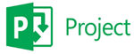**Microsoft Office Project**, aussi appelE **Microsoft Project**, est un logiciel de gestion de projet extrEmement complet et trEs prisE dans les entreprises et organisations de divers secteurs. Ce programme permet aux utilisateurs de planifier, de suivre et de gErer des projets de diffErentes envergures et complexitEs de maniEre efficace. Microsoft Project offre plusieurs avantages, tels que :

La capacitE de planifier les diffErentes Etapes dEun projet, de fixer des EchEances et des calendriers, et de suivre leur progression en temps rEel.

La possibilitE dEaffecter les ressources nEcessaires E chaque phase du projet et de surveiller les coEts associEs E chaque activitE.

L'option de visualiser les projets via des diagrammes de Gantt et des diagrammes de rEseau pour une meilleure comprEhension de l'avancement du projet.

La personnalisation des tableaux de bord pour qu'ils rEpondent aux exigences spEcifiques de chaque projet

#### **b.**     **Les langages de programmation utilisEs**

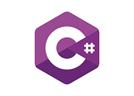**C# (C Sharp)** est un langage de programmation multiparadigme dEveloppE par Microsoft. Il englobe des disciplines telles que la programmation impErative, dEclarative, fonctionnelle, gEnErique, orientEe objet (basEe sur la classe) et orientEe vers les composants. C# est largement utilisE pour le dEveloppement d'applications logicielles, en particulier dans l'EcosystEme de dEveloppement sur la plateforme .NET de Microsoft. Il offre aux dEveloppeurs un ensemble riche de fonctionnalitEs et une syntaxe intuitive pour la crEation d'applications robustes et Evolutives pour une variEtE de plates-formes, y compris les applications de bureau, les applications web et les applications mobiles

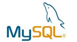**MySQL** est un systEme de gestion de base de donnEes relationnelle open source trEs populaire. Il est utilisE par de nombreuses entreprises et organisations pour stocker et gErer efficacement de grandes quantitEs de donnEes.

**MySQL** est rEputE pour sa fiabilitE, sa stabilitE et sa performance, ainsi que pour sa facilitE d'utilisation. Il permet aux utilisateurs de crEer, de modifier et de supprimer des bases de donnEes, des tables et des colonnes de maniEre simple et intuitive.

En outre, **MySQL** prend en charge le langage de requEte SQL, qui est utilisE pour interroger et extraire des donnEes de la base de donnEes. C'est une solution de base de donnEes flexible qui est utilisEe par des millions d'utilisateurs E travers le monde.

#### **c.**      **Les cadres applicatifs (Frameworks)**

##### **1)**      **WPF**

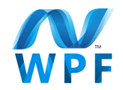Le **Windows Presentation Foundation (WPF)** est un framework de dEveloppement logiciel conEu par Microsoft pour crEer des applications Windows avec des interfaces utilisateur graphiques modernes et interactives. Il utilise un langage de balisage appelE **XAML** (**eXtensible** **Application Markup Language**) pour dEfinir l'apparence et le comportement des ElEments de l'interface utilisateur. WPF offre des fonctionnalitEs telles que la mise en page flexible, les animations, la liaison de donnEes, et facilite la crEation d'applications riches en fonctionnalitEs.

##### **2)**    **NET 8.0**

Le **Framework .NET 8.0** est une plateforme de dEveloppement logiciel conEue par Microsoft pour crEer des applications sur diffErentes plateformes telles que Windows, macOS et Linux. Il fournit un ensemble d'outils et de bibliothEques pour simplifier le processus de dEveloppement et permet aux dEveloppeurs de crEer des applications robustes et Evolutives en utilisant des langages de programmation tels que **C#**, F# et VB.NET.

#### **d.**     **Architecture dEapplication**

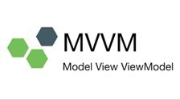L'architecture **MVVM (ModEle-Vue-VueModEle)** est un modEle de conception utilisE pour dEvelopper des applications logicielles, en particulier pour les applications de bureau et mobiles.

Dans **MVVM** :

E         Le **ModEle** gEre les donnEes et la logique mEtier.

E         La **Vue** reprEsente l'interface utilisateur (**UI**) visible par l'utilisateur.

E         Le **VueModEle** agit comme un intermEdiaire entre le ModEle et la Vue, gErant la logique de prEsentation et fournissant les donnEes E afficher.

**MVVM** facilite la sEparation des prEoccupations entre l'interface utilisateur et la logique mEtier, ce qui rend le code plus clair, maintenable et testable. Cela permet Egalement une collaboration plus efficace entre les dEveloppeurs d'interfaces utilisateur et les dEveloppeurs de logiciels.

**e.**      **Format de package d'application**

**MSIX** est un format de package dEapplications Windows qui offre une expErience dEempaquetage moderne pour toutes les applications Windows. Le format de package MSIX conserve les packages dEapplications et/ou les fichiers dEinstallation existants tout en proposant de nouvelles fonctionnalitEs dEempaquetage et de dEploiement modernes pour les applications Win32, WPF et Windows Forms.

MSIX est un format dEempaquetage pour applications Windows conEu pour Etre sEcurisE et fiable.

IV.            Conclusion
-------------------------

Ce premier chapitre a fourni un panorama complet du projet, abordant sa problEmatique, son contexte et les outils techniques utilisEs. Le prochain chapitre se concentrera sur l'analyse et la conception, oE nous examinerons en dEtail les concepts essentiels E la gestion de location de voitures, afin d'amEliorer et d'optimiser nos processus.

  

**Chapitre 2 : Conception et modElisation**
===========================================

I.                  Introduction
--------------------------------

Dans ce chapitre, nous aborderons les fondamentaux de la gestion de projet et du dEveloppement logiciel, en mettant un accent particulier sur l'analyse et la conception de systEmes.

II.              Gestion de projet
----------------------------------

La Gestion de projet est indispensable aux professionnelles, elle joue un rEle de plus en plus dEterminant au quotidien dans toutes les activitEs professionnelles. Chaque annEe, les entreprises ont de nombreux challenges E relever :

ELancement de nouveaux services ou produits innovants (dEveloppement d'un nouveau logiciel par exemple).

E Mise E jour de technologies dEjE implantEes pour rester compEtitif.

E Adaptation E des contraintes lEgales nationales, ou internationales.

### 2.1               Cycle de vie

**Cycle de vie (lifecycle)** dEsigne la pEriode de naissance dEun logiciel E sa mise hors service dEfinitive, en passant par sa construction et son utilisation. La vie dEun logiciel est composEe de diffErentes Etapes. La succession de ces Etapes forme le cycle de vie du logiciel. Il faut contrEler la succession de ces diffErentes Etapes.

### 2.2  Les modelEs du cycle de vie

#### **a.**      **Cycle de vie en cascade**

CEest le modEle le plus simple, il se caractErise par un dEroulement de phases successives. Il est adaptE pour des projets de petite taille, et dont le domaine est bien maEtrisE.

**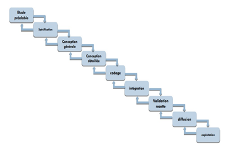**

Figure 11:Cycle de vie en cascade

#### **b.**     **Cycle de vie en v**

Le modEle du cycle en V est un modEle imaginE suite au problEme de rEactivitE du modEle en cascade.

Il permet, en cas d'anomalie, de limiter un retour aux Etapes prEcEdentes. Les phases de la partie montante doivent renvoyer de l'information sur les phases en vis-E-vis lorsque des dEfauts sont dEtectEs, afin d'amEliorer le logiciel. CEest en phase de spEcification que lEon se prEoccupe des procEdures de validation. CEest en phase de conception gEnErale que lEon se prEoccupe des procEdures dEintEgration. CEest en phase de conception dEtaillEe que lEon prEpare les tests unitaires.

Il est adaptE pour des projets dont le domaine est bien maEtrisE.

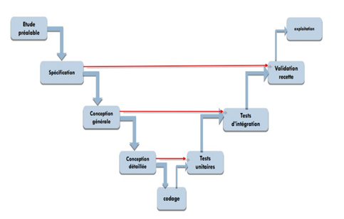

Figure 12: Cycle de vie en v

### 2.3   Diagramme de [_Gantt_](https://www.google.com/search?sca_esv=345267d81bec8f30&sxsrf=ADLYWIIbN5WW3ca2iDYv-cGypVQxzrr71Q:1716119924190&q=diagramme+de+Gantt&spell=1&sa=X&ved=2ahUKEwizoOTz1JmGAxX7T6QEHQCKCM8QkeECKAB6BAgOEAE)

Le **diagramme de Gantt** est une mEthode de reprEsentation graphique qui illustre le calendrier des phases, activitEs, tEches, et ressources d'un projet. Sur l'axe horizontal, on positionne les jours, semaines ou mois, tandis que l'axe vertical liste les diffErentes tEches. Chaque tEche est reprEsentEe par une barre, dont la longueur correspond E sa durEe estimEe.

Les tEches peuvent se suivre ou se dErouler simultanEment, en totalitE ou partiellement. CrEE par Henry L. Gantt en 1917, ce diagramme demeure aujourd'hui l'un des outils les plus couramment utilisEs pour la gestion de projet.

III.           PrEsentation UML
-------------------------------

**UML (Unified Modeling Language)** est un langage graphique standard de modElisation utilisE pour reprEsenter des systEmes logiciels. Il offre une mEthode normalisEe pour visualiser la conception d'un systEme en utilisant diffErents types de diagrammes.

#### a.     Diagramme de cas dEutilisation

Le **diagramme de cas d'utilisation** est un outil de modElisation essentiel qui illustre les interactions entre les utilisateurs et un systEme. Il organise les fonctionnalitEs du systEme en cas d'utilisation, qui sont des unitEs logiques dEcrivant des actions spEcifiques que les utilisateurs peuvent rEaliser avec le systEme. Chaque cas d'utilisation capture un besoin utilisateur, offrant une vue centrEe sur l'utilisateur plutEt qu'une approche technique.

Composants Principaux :

E          **Acteurs** : Les utilisateurs ou autres systEmes qui interagissent avec le systEme.

E          **Cas d'utilisation** : Les fonctionnalitEs spEcifiques du systEme, pertinentes pour les acteurs.

E          **Relations** : Les connexions entre les cas d'utilisation qui montrent comment ils sont liEs ou dEpendent les uns des autres.

Les diagrammes de cas d'utilisation sont essentiels pour s'assurer que le dEveloppement informatique rEpond prEcisEment aux attentes des utilisateurs. Ils jouent un rEle crucial en garantissant la fonctionnalitE et l'efficacitE du systEme final.

#### b.     Diagramme de classe

**Un diagramme de classe** est un type de diagramme structurel utilisE en gEnie logiciel pour dEcrire la structure statique d'un systEme. Il montre les classes du systEme, leurs propriEtEs, et les relations entre elles. Cela inclut la visualisation des interactions comme les associations, les hEritages, et les dEpendances

**Composants Principaux :**

v  **Classes** **:** ReprEsentEes par des rectangles, les classes comprennent trois parties :

E        **Nom de la Classe :** Le titre de la classe, souvent un nom de substantif.

E        **Attributs :** Variables ou propriEtEs stockEes dans la classe.

E        **MEthodes :** Fonctions ou procEdures que la classe peut exEcuter.

v  **Relations** **:**

E         **Association :** Une connexion gEnErale entre deux classes, reprEsentEe par une ligne.

E         **AgrEgation :** Une forme spEciale d'association qui reprEsente une relation "tout-partie", marquEe par un diamant blanc E une extrEmitE de la ligne.

E         **Composition :** Une forme plus forte d'agrEgation avec un diamant noir, indiquant une possession exclusive.

E         **HEritage :** ReprEsentE par une flEche pointue, indiquant une relation de type "est-un".

v  **VisibilitE** **:** Indique si les attributs ou mEthodes sont accessibles depuis d'autres classes, souvent notE par des symboles (**+, -, #**).

#### c.      Diagramme de sEquence

**Le diagramme de sEquence** est un outil crucial en gEnie logiciel, relevant des diagrammes comportementaux et plus spEcifiquement des diagrammes d'interactions. Il est utilisE pour reprEsenter les interactions entre les diffErents objets et acteurs d'un systEme informatique, montrant comment ils communiquent entre eux au fil du temps.

Composants Principaux :

v  **Lignes** **de Vie :** ReprEsentEes par des lignes verticales qui descendent des entEtes des objets ou acteurs, elles indiquent la prEsence de l'objet au fil du temps.

v  **Barres** **d'Activation :** Des rectangles fins sur les lignes de vie qui montrent quand un objet est actif dans le processus.

v  **Messages** **:** FlEches horizontales qui montrent les interactions entre les objets, avec des annotations pour dEcrire l'action ou la mEthode appelEe.

IV.            Notre projet de location de voiture
--------------------------------------------------

### a.      Planification

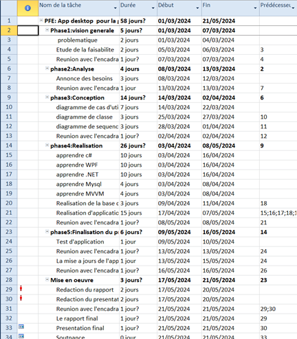

Figure 13 : Planification

### b.     Cycle de vie en V

Nous avons choisi le cycle en V. Car ce modEle est caractErisE par le parallElisme, dans ce modEle verticalement nous trouvons les Etapes du dEveloppement et horizontalement la vErification.

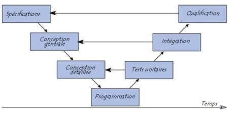

Figure 14: Cycle de vie en v

### c.      Diagramme de Gantt

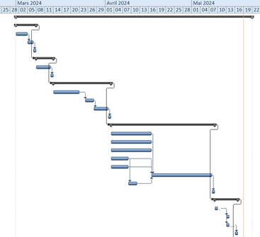

Figure 15 : Diagramme de GANTT partie1

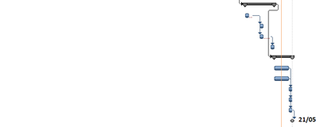

Figure 16: Diagramme de GANTT partie2

### d.     ModElisation

#### **1)**      **Les acteurs**

Identification des acteurs et leur rEle :

**Acteurs**

**REle**

**Administrateur**

E         GErer les voitures

E         GErer les employEes

**EmployE**

E         GErer les clients

E         GErer les rEservations

E         GErer les paiements

**Client**

E         Voir les voitures disponibles

E         Faire une rEservation

**Tableau** **2:** **table des acteurs**

#### **2)**     **Diagramme de cas dEutilisation**

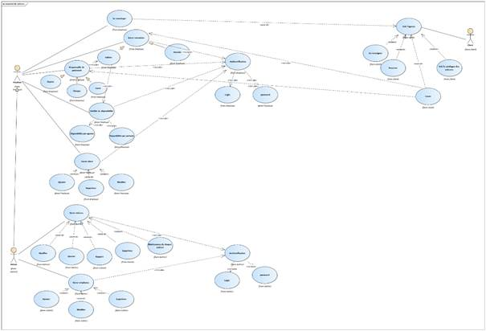

Figure 17 : Diagramme de cas dEutilisation

#### **3)**     **Diagramme de classe**

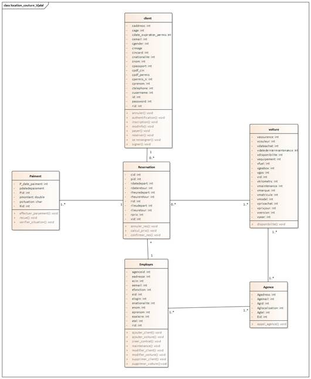

Figure 18 :Diagramme de classe

  

#### **4)**     **Diagramme de** **sEquence**

**Pour login**

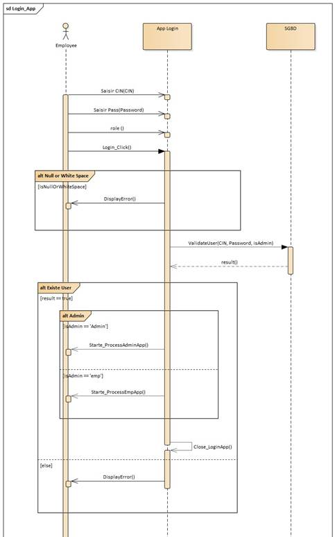

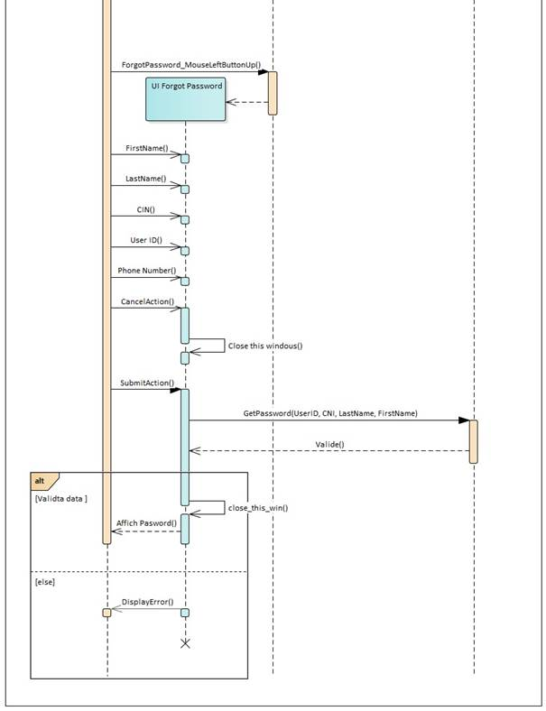

Figure 19 : diagramme de sEquence(login)

**Pour employer**

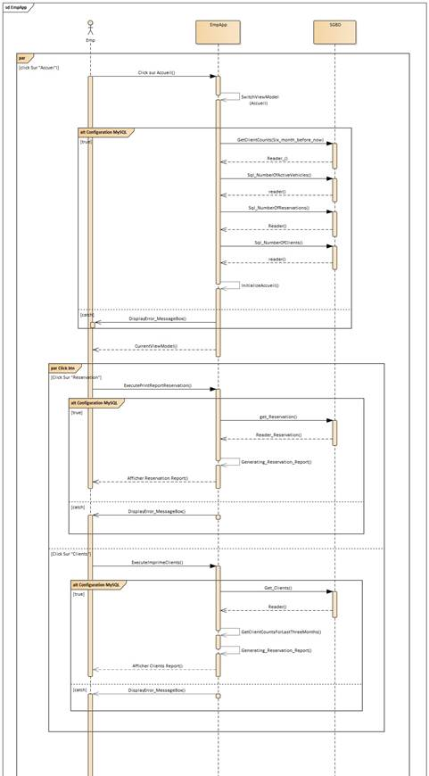

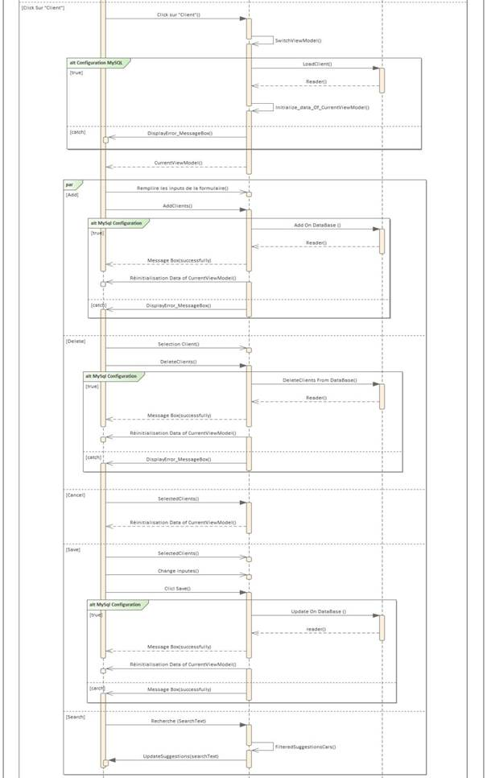

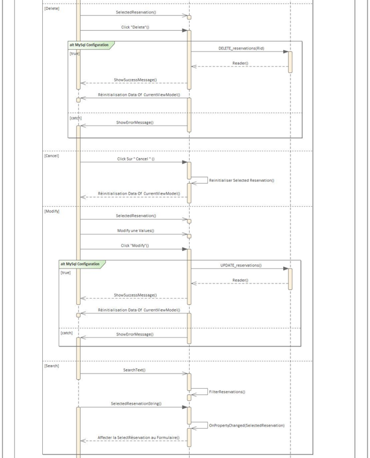

Figure 20: diagramme de sEquence (employer)

**Pour lEadministrateur**

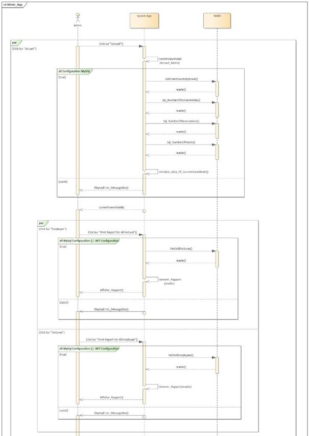

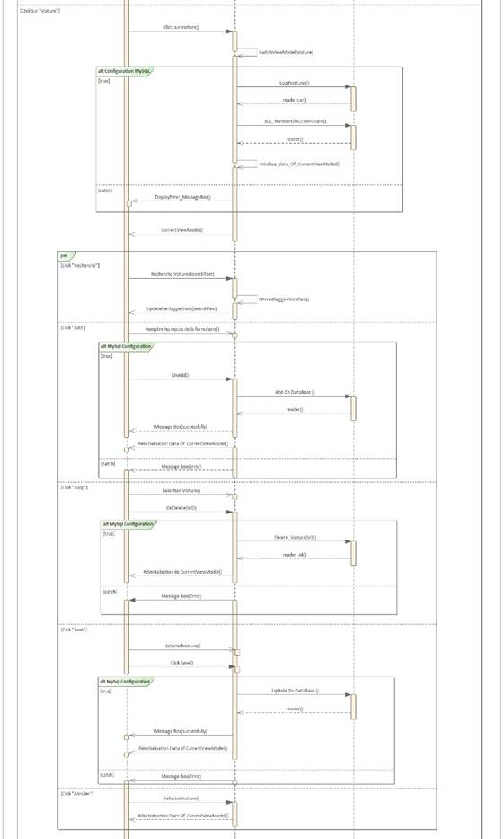

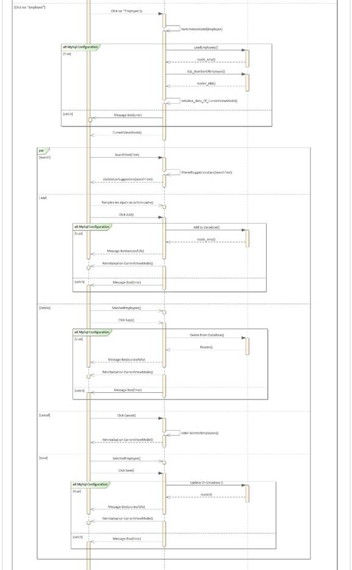

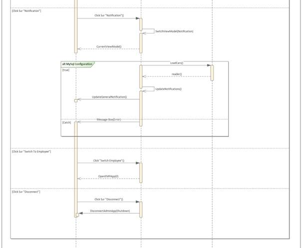

Figure 21 : diagramme de sEquence (administrateur)

Dans ces diagrammes ???????

V.               Conclusion
---------------------------

Dans ce chapitre, nous avons dEveloppE les divers composants de notre systEme. Le chapitre suivant sera consacrE E la mise en Euvre de notre modEle.

  

**Chapitre 3 : REalisation du projet**
======================================

I.                  Introduction
--------------------------------

La phase de rEalisation est une Etape trEs importante dans le cycle de vie de nos applications, cette phase permet de concrEtiser notre projet par le dEveloppement des interfaces et par des rEalisations concrEtes des fonctionnalitEs du systEme. Pour rEaliser ces applications nous avons en recourt E plusieurs outils de dEveloppement. Dans cette derniEre partie on va prEsenter le rEsultat final de notre application.

II.              Application Desktop
------------------------------------

### 2.1 Les interfaces et les explications

#### **1)**      **Authentification**

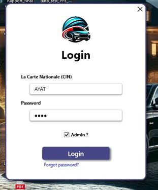

Figure 22 : login

L'interface d'authentification constitue la premiEre Etape d'interaction entre l'utilisateur et notre application de bureau.

#### **2)**     **Interface Forget password**

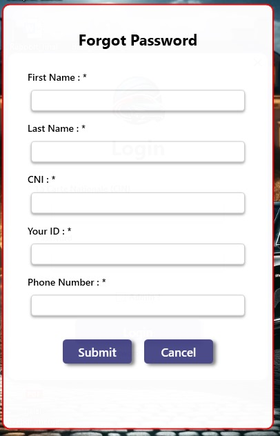

Figure 23 : forget password

L'interface de rEcupEration de mot de passe est une partie essentielle de notre application de bureau. Elle aide les utilisateurs E rEcupErer leur accEs s'ils oublient leurs identifiants.

#### **3)**     **Les interfaces dEadministrateur**

##### **a.**      **Interface accueil**

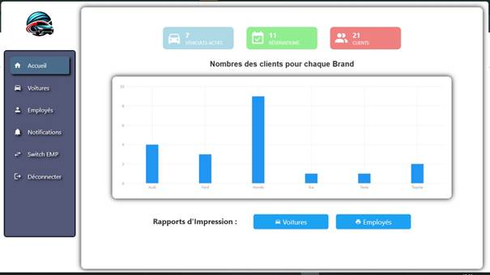

Figure 24 :  interface dEaccueil pour l'administrateur

L'interface d'accueil pour l'administrateur fournit un aperEu complet des vEhicules sortis, des rEservations effectuEes et du nombre de clients enregistrEs dans la base de donnEes. Elle prEsente des graphiques illustrant le nombre de clients par marque, ainsi que divers indicateurs clEs. De plus, elle offre des options pour imprimes des rapports sur les voitures et les employEs.

##### **b.**     **Interface voiture**

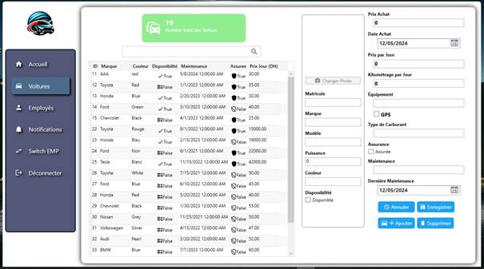

Figure 25 :  interface des voitures pour l'administrateur

L'interface des voitures pour l'administrateur affiche le nombre total de vEhicules enregistrEs dans la base de donnEes. Elle propose Egalement des fonctionnalitEs permettant d'ajouter une nouvelle voiture, ainsi que de modifier ou supprimer les entrEes existantes, facilitant ainsi la gestion complEte des voitures. 

##### **c.**      **Interface employEe**

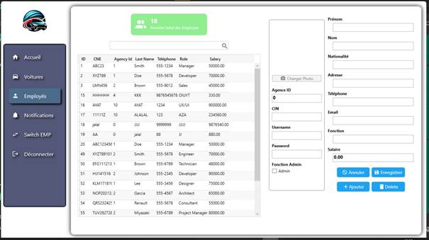

Figure 26 : interface des employEs pour l'administrateur

L'interface des employEs pour l'administrateur affiche le nombre total d'employEs enregistrEs dans la base de donnEes. Elle propose Egalement des fonctionnalitEs permettant d'ajouter un nouvel employE, ainsi que de modifier ou supprimer les entrEes existantes, facilitant ainsi la gestion complEte du personnel. 

##### **d.**     **Interface notification**

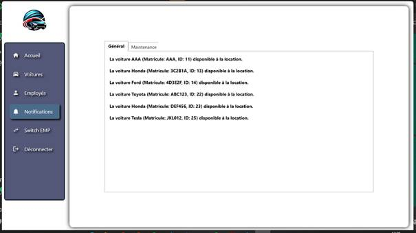

Figure 27 :  interface de notification pour l'administrateur

L'interface de notification indique, sous l'onglet "GEnEral", les vEhicules disponibles pour la location. Dans l'onglet "Maintenance", elle affiche des alertes pour les vEhicules qui requiErent une maintenance. Cette fonctionnalitE assure une gestion efficace du parc automobile en offrant des mises E jour en temps rEel sur l'Etat des vEhicules, facilitant ainsi l'organisation de la location et de la maintenance des voitures.

#### **4)**     **Les interfaces dEemployEe**

##### **a.**      **Interface accueil**

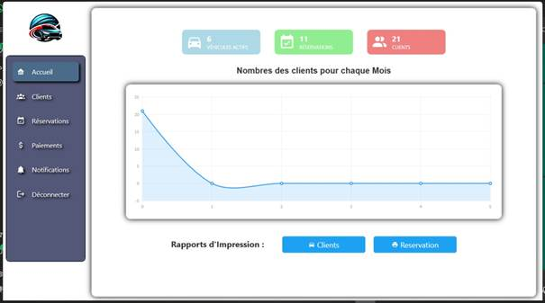

Figure 28 :  interface d'accueil pour l'employE

L'interface d'accueil pour l'employE prEsente un rEsumE dEtaillE des rEservations effectuEes et du total de clients enregistrEs dans la base de donnEes. Un graphique y illustre le nombre de clients ayant louE une ou plusieurs voitures chaque mois, accompagnE d'autres indicateurs clEs. De plus, cette interface offre la possibilitE d'imprimer des rapports approfondis sur les clients et les rEservations.

##### **b.**     **Interface client**

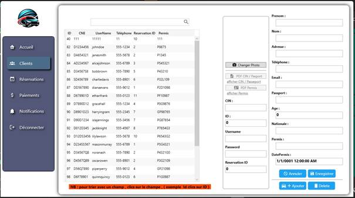

Figure 29 : interface client pour l'employE

L'interface client affiche le nombre total de clients enregistrEs dans la base de donnEes. Elle offre Egalement des options pour ajouter, modifier ou supprimer des clients, facilitant ainsi la gestion efficace de la clientEle. Cette interface centralise les informations client, amEliorant l'organisation et la communication au sein de l'entreprise.

##### **c.**      **Interface rEservation**

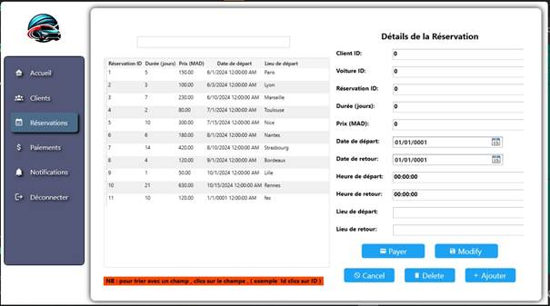

Figure 30 :  interface de rEservation pour l'employE

L'interface de rEservation permet d'ajouter, de modifier ou de supprimer des rEservations, simplifiant ainsi leur gestion. Elle centralise toutes les informations relatives aux rEservations, ce qui contribue E amEliorer l'organisation et la communication dans l'entreprise.

##### **d.**     **Interface paiements**

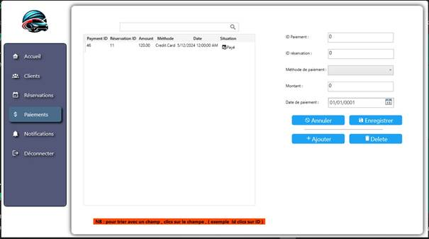

Figure 31 : interface de paiements pour l'employE

L'interface de paiements permet d'ajouter, d'enregistrer, ou de supprimer des paiements.

##### **e.**      **Interface notification**

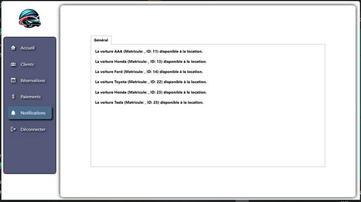

Figure 32 : interface de notification pour l'employE

L'interface de notification indique, sous l'onglet "GEnEral", les vEhicules disponibles pour la location.

  

**Conclusion GEnErale**
=======================

Ce projet constitue une Etape cruciale de notre parcours de formation, offrant une excellente opportunitE pour mettre en pratique des connaissances thEoriques prEalablement acquises tout en nous permettant de dEvelopper de nouvelles compEtences techniques. Pour mener E bien ce projet, nous avons ElaborE un plan dEtaillE, facilitant l'organisation de notre temps limitE et optimisant notre efficacitE.

ParallElement, nous avons dEcouvert l'importance cruciale de la recherche et de la communication dans l'accEs E des informations pertinentes, ainsi que la gestion du temps et la planification des tEches pour une exEcution fluide des travaux. GrEce E un environnement de travail propice et E une coordination efficace, nous avons rEussi E achever le projet conformEment au cahier des charges, tout en y ajoutant des fonctionnalitEs supplEmentaires pour en augmenter l'efficacitE et l'attrait.

Bien que notre projet rEponde dEjE E tous les besoins EnoncEs dans le cahier des charges, nous envisageons d'apporter des amEliorations futures pour amEliorer la performance de l'application.

Les rEsultats obtenus jusqu'E prEsent sont prometteurs et nous motivent E poursuivre le dEveloppement de ce projet.

  

**Webographie**
===============

**MySQL****:** [https://www.w3schools.com/](https://www.w3schools.com/)

**MSIX :** [https://youtu.be/4t2TI8ImwMY](https://youtu.be/4t2TI8ImwMY)

**C# WPF :** [https://www.youtube.com/watch?v=t9ivUosw\_iI&list=PLih2KERbY1HHOOJ2C6FOrVXIwg4AZ-hk1](https://www.youtube.com/watch?v=t9ivUosw_iI&list=PLih2KERbY1HHOOJ2C6FOrVXIwg4AZ-hk1)

**WPF MVVM :**

[https://www.youtube.com/watch?v=fZxZswmC\_BY&list=PLA8ZIAm2I03hS41Fy4vFpRw8AdYNBXmNm](https://www.youtube.com/watch?v=fZxZswmC_BY&list=PLA8ZIAm2I03hS41Fy4vFpRw8AdYNBXmNm)
